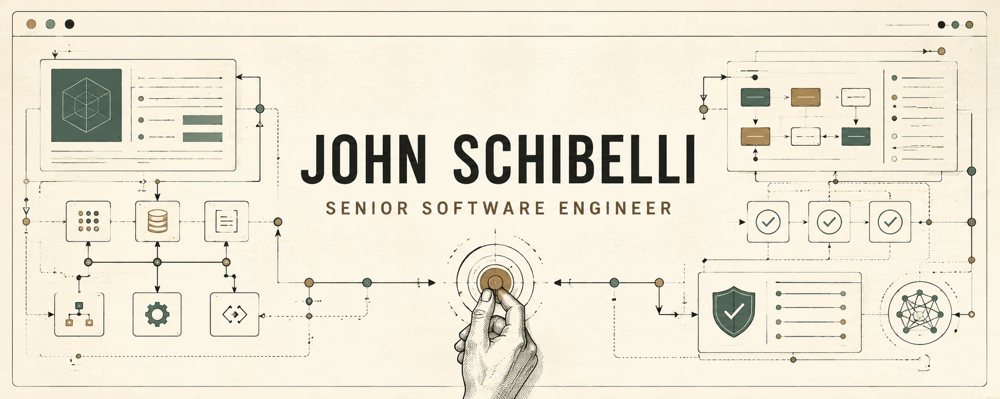

# John Schibelli

**Senior Software Engineer building production React and Next.js systems, test automation, and governed AI-assisted engineering workflows.**

I build customer-facing applications and internal platforms where product design, frontend architecture, APIs, content systems, automation, and delivery need to work as one system. I care about accessible interfaces, predictable builds, testable behavior, and engineering decisions that can be traced to evidence.

Based in Northern New Jersey and open to remote opportunities.

## Selected engineering work

| Project | Engineering evidence |
| --- | --- |
| [Atlas](https://github.com/IntraWeb-Technology/nexus/tree/main/apps/atlas-web) | Next.js 16 portfolio frontend built against documented Figma authority and a versioned Build Manifest. The workflow combines committed AI rules, hybrid Strapi content boundaries, Playwright and axe validation, and a required GitHub CI Gate. |
| [Nexus](https://github.com/IntraWeb-Technology/nexus) | IntraWeb Technology's pnpm and Turborepo platform for Atlas, the company site, an authenticated client portal, a shared Strapi CMS, n8n workflows, and operational tooling. |
| [Portfolio OS](https://github.com/jschibelli/portfolio-os) | Next.js 15 and TypeScript monorepo powering my current portfolio, with GitHub Actions, Playwright coverage, documentation, and Vercel delivery. |
| [IntraWeb Technology Website](https://www.intrawebtech.com/) ([source](https://github.com/IntraWeb-Technology/nexus/tree/main/apps/iw-site-q2)) | Next.js 16 production marketing site with contact and intake workflows, reCAPTCHA Enterprise, HubSpot, Resend, n8n integration, GitHub Actions, and Vercel delivery. |

## How I engineer

- Start with product, design, content, and architecture authority before implementation.
- Use AI to accelerate bounded work, not to invent requirements or approve its own output.
- Build automated checks around behavior, accessibility, contracts, and production builds.
- Keep release gates, deferred risk, and human decisions explicit.
- Prefer maintainable systems and clear operational boundaries over decorative complexity.

AI is part of my engineering workflow through ChatGPT, Cursor, and Claude. Product truth remains with approved requirements, design authority, versioned contracts, automated evidence, and human release ownership.

## Core stack

| Area | Technologies |
| --- | --- |
| Frontend | React, Next.js, TypeScript, Tailwind CSS, accessible component systems |
| Backend and content | Node.js, NestJS, REST, GraphQL, PostgreSQL, Supabase, Strapi, Contentful |
| Quality | Playwright, Jest, axe, API validation, visual review |
| Platform | GitHub Actions, Vercel, Docker, Turborepo, pnpm, n8n |
| Collaboration | Figma, documented decision records, AI-assisted implementation governance |

## Open to

I am pursuing Senior Software Engineer and Senior Front-End Engineer roles, along with focused consulting work involving React and Next.js architecture, test automation, platform modernization, and AI-assisted engineering workflows.

## Connect

[Portfolio](https://johnschibelli.dev) · [LinkedIn](https://www.linkedin.com/in/johnschibelli/) · [Upwork](https://www.upwork.com/freelancers/~011df46c9ca84040b5) · [IntraWeb Technology](https://www.intrawebtech.com/) · [Email](mailto:jschibelli@gmail.com)
